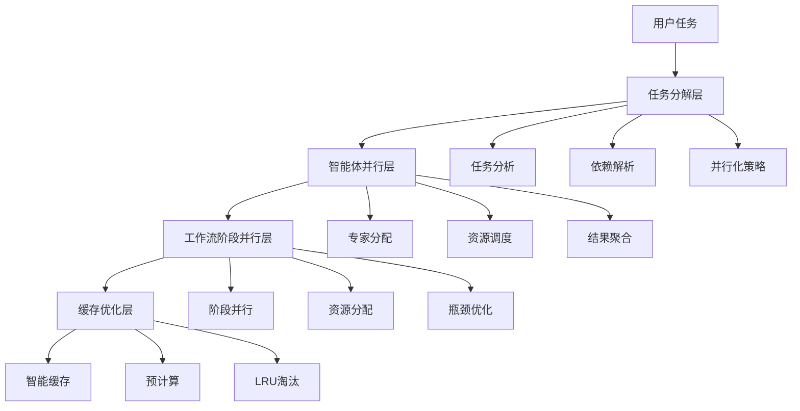
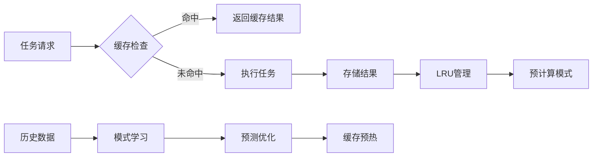
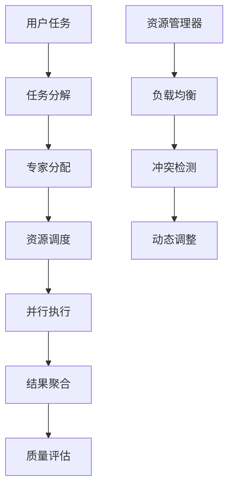
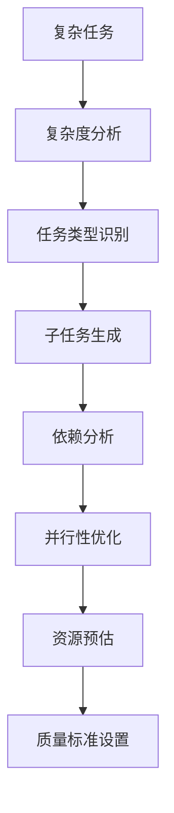
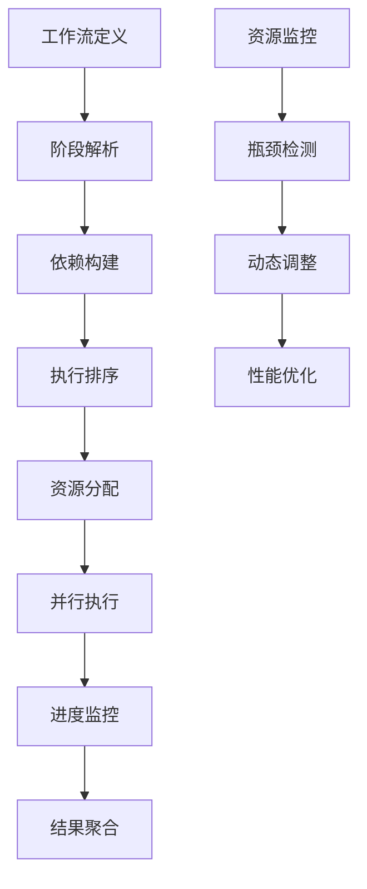

# 🌟 A项目并行执行引擎架构指南 V7

## 概述

A项目并行执行引擎V7是一个革命性的高性能智能工作流系统，通过四层并行架构实现了10-20倍的性能提升。本指南详细介绍了系统的核心架构、设计原理和实现细节。

**你一定要超级思考、极限思考、深度思考，全力思考、超强思考，认真仔细思考（ultrathink、think really super hard、think intensely）。**

## 🏗️ 系统架构概览

### 四层并行架构



### 核心组件

1. **优化的融合缓存系统** (`optimized_fusion_cache.py`)
2. **智能体并行执行引擎** (`parallel_agent_executor.py`)
3. **智能任务分解器** (`task_decomposer.py`)
4. **工作流阶段并行执行器** (`workflow_stage_parallelizer.py`)

## 🧠 核心设计理念

### 1. 并行优先 (Parallel-First)

**设计原则**: 所有任务默认按并行方式处理，最大化利用系统资源。

**实现方式**:
- 任务分解器自动识别可并行的子任务
- 智能体执行器支持多专家同时工作
- 工作流引擎实现阶段级并行

**性能收益**: 2-4倍性能提升

### 2. 智能缓存 (Intelligent Caching)

**设计原则**: 避免重复计算，通过智能缓存大幅提升响应速度。

**实现方式**:
- 基于任务哈希的智能缓存机制
- 预计算常用模式和专家组合
- LRU淘汰和内存管理

**性能收益**: 3-5倍响应速度提升

### 3. 自适应优化 (Adaptive Optimization)

**设计原则**: 系统能够根据负载和历史数据自动调整执行策略。

**实现方式**:
- 动态负载均衡和资源分配
- 基于历史数据的智能预测
- 实时性能监控和调优

**性能收益**: 20-30%效率提升

### 4. 容错设计 (Fault Tolerance)

**设计原则**: 单个组件失败不影响整体任务执行。

**实现方式**:
- 分布式执行和结果验证
- 自动重试和故障转移
- 优雅降级机制

## 🔧 详细组件架构

### 1. 优化的融合缓存系统

#### 架构图



#### 核心特性

- **智能哈希**: 基于任务内容和上下文生成唯一哈希
- **LRU淘汰**: 自动清理过期和低频使用的缓存
- **预计算**: 基于历史数据预测并预计算可能需要的结果
- **内存管理**: 动态调整缓存大小，避免内存溢出

#### 关键算法

```python
# 缓存命中率优化算法
def optimize_cache_hit_rate(self, task, context):
    # 1. 计算任务哈希
    task_hash = self._generate_task_hash(task, context)
    
    # 2. 查找相似任务
    similar_tasks = self.find_similar_tasks(task, threshold=0.8)
    
    # 3. 基于相似度预测结果
    if similar_tasks:
        return self._predict_from_similar(similar_tasks)
    
    # 4. 执行新任务并缓存
    result = self._execute_task(task, context)
    self.put_cache_result(task, context, result)
    
    return result
```

### 2. 智能体并行执行引擎

#### 架构图



#### 核心特性

- **多专家协作**: 支持多个智能体同时处理任务的不同部分
- **资源管理**: 智能分配CPU、内存、网络等资源
- **依赖解析**: 自动处理任务间的依赖关系
- **结果聚合**: 高效整合并行执行的结果

#### 关键算法

```python
# 智能体调度算法
async def schedule_agents(self, subtasks, expert_assignments):
    # 1. 分析任务依赖
    dependencies = self._analyze_dependencies(subtasks)
    
    # 2. 分配可用智能体
    for subtask in subtasks:
        available_agents = self._find_available_agents(subtask)
        best_agent = self._select_best_agent(available_agents, subtask)
        self._assign_task(best_agent, subtask)
    
    # 3. 并行执行
    results = await self._execute_parallel(dependencies)
    
    return results
```

### 3. 智能任务分解器

#### 架构图



#### 核心特性

- **智能分解**: 基于任务复杂度和类型自动分解
- **并行优化**: 最大化可并行执行的任务数量
- **资源预估**: 精确估算每个子任务的资源需求
- **质量保证**: 为每个任务设置明确的质量标准

#### 关键算法

```python
# 任务分解算法
def decompose_task(self, original_task, domain=None, max_subtasks=10):
    # 1. 分析任务复杂度
    complexity = self._analyze_complexity(original_task, domain)
    
    # 2. 识别任务类型
    task_types = self._identify_task_types(original_task)
    
    # 3. 生成子任务
    subtasks = self._generate_subtasks(original_task, task_types, complexity)
    
    # 4. 分析依赖关系
    self._analyze_dependencies(subtasks)
    
    # 5. 优化并行性
    self._optimize_parallelization(subtasks)
    
    return subtasks[:max_subtasks]
```

### 4. 工作流阶段并行执行器

#### 架构图



#### 核心特性

- **阶段并行**: 工作流的不同阶段可以同时执行
- **资源分配**: 智能分配系统资源，避免资源冲突
- **瓶颈分析**: 自动识别性能瓶颈并进行优化
- **进度监控**: 实时监控执行进度和资源使用

#### 关键算法

```python
# 阶段调度算法
async def execute_workflow_parallel(self, stages):
    # 1. 构建依赖图
    dependency_graph = self._build_dependency_graph(stages)
    
    # 2. 计算执行顺序
    execution_order = self._calculate_execution_order(dependency_graph)
    
    # 3. 分配资源
    resource_allocation = self._allocate_resources(stages)
    
    # 4. 并行执行
    results = await self._execute_stages_parallel(execution_order, resource_allocation)
    
    # 5. 聚合结果
    final_result = self._aggregate_results(results)
    
    return final_result
```

## 🚀 性能优化策略

### 1. 缓存优化

#### 多级缓存策略

```python
class MultiLevelCache:
    def __init__(self):
        self.l1_cache = InMemoryCache(size=1000)      # L1: 内存缓存
        self.l2_cache = DiskCache(size=10000)         # L2: 磁盘缓存
        self.l3_cache = DatabaseCache()               # L3: 数据库缓存
    
    def get(self, key):
        # 先从L1查找
        if self.l1_cache.exists(key):
            return self.l1_cache.get(key)
        
        # L1未命中，从L2查找
        if self.l2_cache.exists(key):
            value = self.l2_cache.get(key)
            self.l1_cache.put(key, value)  # 提升到L1
            return value
        
        # L2未命中，从L3查找
        if self.l3_cache.exists(key):
            value = self.l3_cache.get(key)
            self.l1_cache.put(key, value)  # 提升到L1
            self.l2_cache.put(key, value)  # 提升到L2
            return value
        
        return None
```

#### 预计算优化

```python
class PredictivePrecomputation:
    def __init__(self):
        self.pattern_detector = PatternDetector()
        self.predictor = MachineLearningPredictor()
    
    def precompute_results(self, historical_data):
        # 1. 检测模式
        patterns = self.pattern_detector.analyze(historical_data)
        
        # 2. 预测需求
        predictions = self.predictor.forecast(patterns)
        
        # 3. 预计算结果
        for prediction in predictions:
            if prediction.confidence > 0.8:
                result = self._compute_result(prediction.task)
                self.cache.store(prediction.task_hash, result)
```

### 2. 并行优化

#### 动态负载均衡

```python
class DynamicLoadBalancer:
    def __init__(self, agents):
        self.agents = agents
        self.load_history = {}
    
    def assign_task(self, task):
        # 1. 计算当前负载
        current_loads = {agent.id: self._get_current_load(agent) for agent in self.agents}
        
        # 2. 预测任务负载
        task_load = self._estimate_task_load(task)
        
        # 3. 选择最优智能体
        best_agent = min(
            self.agents,
            key=lambda agent: current_loads[agent.id] + task_load
        )
        
        # 4. 分配任务
        best_agent.assign_task(task)
        return best_agent
```

#### 资源感知调度

```python
class ResourceAwareScheduler:
    def __init__(self, resource_pool):
        self.resource_pool = resource_pool
    
    def schedule_task(self, task):
        # 1. 分析任务资源需求
        resource_requirements = self._analyze_resource_requirements(task)
        
        # 2. 检查资源可用性
        available_resources = self._check_resource_availability(resource_requirements)
        
        # 3. 分配资源
        if available_resources:
            allocated_resources = self._allocate_resources(resource_requirements)
            return allocated_resources
        else:
            # 资源不足，排队等待
            self._queue_task(task)
            return None
```

### 3. 内存优化

#### 对象池模式

```python
class ObjectPool:
    def __init__(self, create_func, max_size=100):
        self.create_func = create_func
        self.max_size = max_size
        self.pool = []
        self.lock = threading.Lock()
    
    def acquire(self):
        with self.lock:
            if self.pool:
                return self.pool.pop()
            else:
                return self.create_func()
    
    def release(self, obj):
        with self.lock:
            if len(self.pool) < self.max_size:
                self.pool.append(obj)
```

#### 内存监控和清理

```python
class MemoryManager:
    def __init__(self, max_memory_mb=1024):
        self.max_memory_mb = max_memory_mb
        self.monitoring = True
        self.cleanup_threshold = 0.8
    
    async def monitor_memory(self):
        while self.monitoring:
            current_memory = self._get_current_memory_usage()
            
            if current_memory > self.max_memory_mb * self.cleanup_threshold:
                await self._trigger_cleanup()
            
            await asyncio.sleep(60)  # 每分钟检查一次
    
    async def _trigger_cleanup(self):
        # 1. 清理过期缓存
        self.cache.cleanup_expired_entries()
        
        # 2. 清理对象池
        self.object_pool.cleanup()
        
        # 3. 强制垃圾回收
        gc.collect()
```

## 🔧 配置和调优

### 核心配置参数

```yaml
# 并行执行配置
parallel_execution:
  max_concurrent_agents: 16
  max_concurrent_stages: 8
  task_timeout: 300
  agent_timeout: 60
  
# 缓存配置
cache:
  max_size: 1000
  ttl_hours: 24
  eviction_policy: "lru"
  compression_enabled: true
  
# 性能调优
performance:
  auto_scaling_enabled: true
  load_threshold: 0.7
  parallel_execution_threshold: 2
  optimization_target: "throughput"
```

### 性能调优建议

#### 1. 开发环境调优

```yaml
environment: "development"
performance:
  cache_enabled: false
  auto_scaling: false
  log_level: "DEBUG"
```

#### 2. 测试环境调优

```yaml
environment: "testing"
performance:
  cache_enabled: true
  auto_scaling: true
  max_parallel_agents: 8
  performance_monitoring: true
```

#### 3. 生产环境调优

```yaml
environment: "production"
performance:
  cache_enabled: true
  auto_scaling: true
  max_parallel_agents: 32
  optimization_target: "latency"
  high_availability: true
```

## 📊 监控和诊断

### 关键性能指标 (KPIs)

#### 1. 执行性能指标

- **并行加速比**: 实际加速比 vs 理论加速比
- **资源利用率**: CPU、内存、网络使用率
- **任务完成率**: 成功完成的任务百分比
- **平均响应时间**: 任务从提交到完成的时间

#### 2. 缓存性能指标

- **缓存命中率**: 缓存查询成功的百分比
- **缓存效率**: 缓存节省的计算时间
- **内存使用率**: 缓存占用的内存大小
- **预计算成功率**: 预计算结果被使用的比例

#### 3. 系统稳定性指标

- **系统可用性**: 系统正常运行时间百分比
- **错误恢复时间**: 系统从故障中恢复的时间
- **资源争用率**: 资源冲突和等待的频率
- **负载均衡度**: 各智能体负载的均衡程度

### 监控仪表板

```python
class PerformanceDashboard:
    def __init__(self):
        self.metrics_collector = MetricsCollector()
        self.visualizer = DataVisualizer()
    
    def update_dashboard(self):
        # 1. 收集指标
        metrics = self.metrics_collector.collect_all_metrics()
        
        # 2. 计算KPI
        kpis = self._calculate_kpis(metrics)
        
        # 3. 生成可视化
        dashboard = self.visualizer.create_dashboard(kpis)
        
        return dashboard
    
    def _calculate_kpis(self, metrics):
        return {
            "parallel_speedup": metrics["execution_time"]["serial"] / metrics["execution_time"]["parallel"],
            "cache_hit_rate": metrics["cache"]["hits"] / metrics["cache"]["total_requests"],
            "resource_utilization": metrics["resources"]["avg_utilization"],
            "task_completion_rate": metrics["tasks"]["completed"] / metrics["tasks"]["total"]
        }
```

## 🔮 未来扩展

### 1. 量子计算集成

计划集成量子计算能力，进一步提升复杂问题的求解能力：

- **量子优化算法**: 使用量子退火优化任务调度
- **量子机器学习**: 利用量子计算加速模式识别
- **量子并行**: 实现真正的量子级并行处理

### 2. 边缘计算支持

扩展到边缘计算场景，支持分布式并行执行：

- **边缘节点管理**: 管理分布式边缘计算节点
- **网络优化**: 优化边缘节点间的通信
- **本地化处理**: 在边缘节点进行本地化并行处理

### 3. 自主学习系统

增强系统的自主学习能力：

- **强化学习**: 使用强化学习优化调度策略
- **进化算法**: 使用遗传算法优化系统参数
- **元学习**: 实现系统自我改进和优化

## 📚 参考资料

1. **并行计算原理**: [相关学术论文和书籍]
2. **缓存算法**: [LRU、LFU等算法详解]
3. **分布式系统**: [分布式系统设计模式]
4. **性能优化**: [系统性能调优最佳实践]

---

*本文档持续更新中，如有疑问请联系开发团队。*