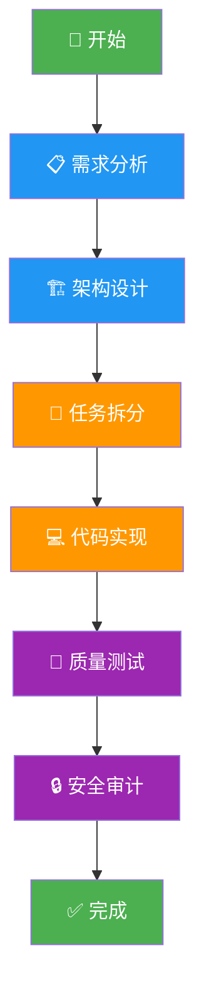
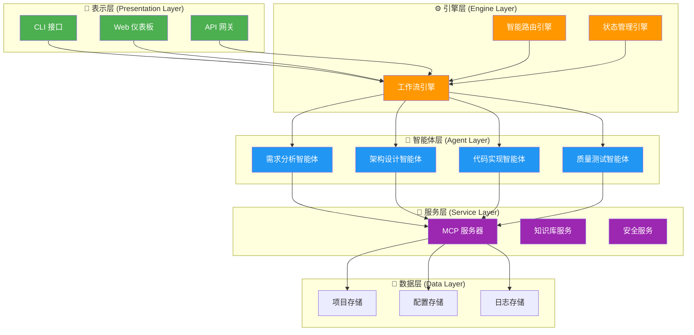
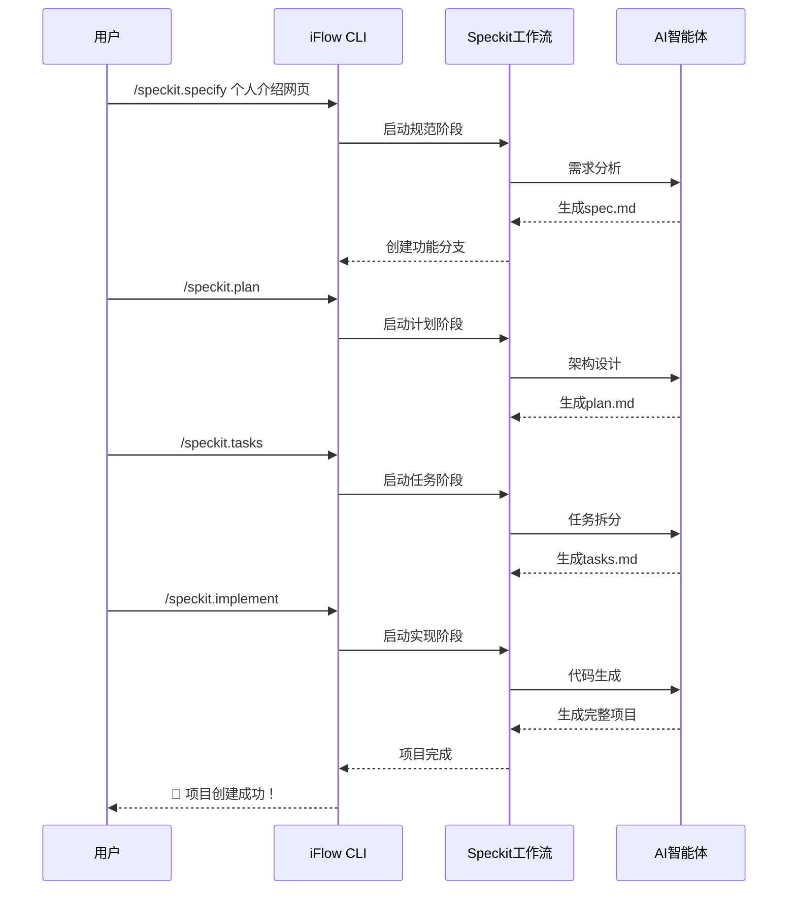
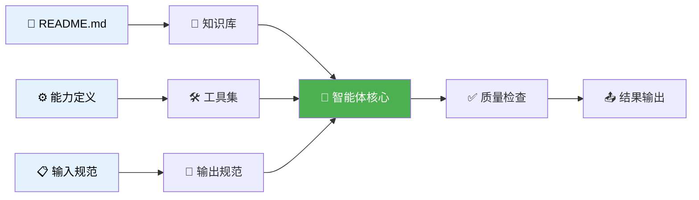
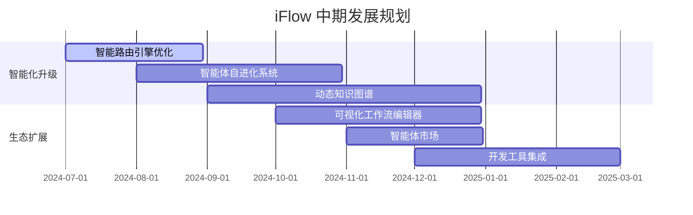

# 🚀 iFlow - AI驱动的自动化开发工作流

[](https://opensource.org/licenses/Apache-2.0)
[](https://www.python.org/)
[](https://github.com/lzA6/Optimization-Cli-Workflow/)
[](./CONTRIBUTING.md)

**欢迎来到 `iFlow` 的世界！** 这是一个雄心勃勃的开源项目，旨在通过 AI 智能体和标准化工作流，彻底革新软件开发的模式。我们不仅仅是在构建一个工具，更是在探索一种全新的、与 AI 协作共生的开发哲学。🌟

---

## 📜 我们的哲学：让创造回归纯粹

> "工具的意义在于延伸人的能力，而非成为人的枷锁。"

在软件开发的星辰大海中，我们常常迷失在繁琐的配置、重复的劳动和复杂的技术细节里，忘记了我们最初的航向——**创造**。

`iFlow` 的诞生源于一个纯粹的信念：**将开发者从重复的"体力劳动"中解放出来，回归创造的本源。** 🧠

我们相信，未来的开发是人与 AI 的"双人舞"。开发者是那个提出"我想去哪里"的**领航员**，而 AI 智能体则是那个"知道如何造船、如何航行"的**大副**。`iFlow` 就是连接领航员与大副的"舰桥"系统。

它不仅仅是一个 CLI 工具，更是一个：

<div align="center">

| 功能 | 描述 | 图标 |
|------|------|------|
| **思想放大器** | 将模糊的想法转化为清晰、可执行的蓝图 | 🔬 |
| **效率倍增器** | 将数小时甚至数天的工作压缩到分钟级别 | ⚡ |
| **质量守护者** | 通过内置最佳实践确保代码质量 | 🛡️ |
| **知识传承者** | 将最佳实践固化为可复用的智能体和工作流 | 📚 |

</div>

加入我们，不仅仅是使用一个工具，更是参与一场关于未来软件开发的伟大实验。无论您是刚入门的新手，还是经验丰富的专家，在这里，您都能找到"我来，我也行！"的愉悦和成就感。💖

---

## ✨ 什么是 iFlow？

`iFlow` 是一个**可扩展的、基于命令行的 AI 智能体与工作流编排框架**。

想象一下，您只需要用简单的指令告诉 `iFlow` 您的目标：

```bash
/speckit.specify 我想要一个用户登录功能
```

然后，`iFlow` 的智能体大军就会自动为您完成整个开发流程：



### 🎯 核心优势

<div class="features-grid">
  <div class="feature-card">
    <div class="feature-icon">🤖</div>
    <h3>极致的自动化</h3>
    <p>将繁琐的开发流程自动化，让您专注于核心业务逻辑</p>
  </div>
  
  <div class="feature-card">
    <div class="feature-icon">📜</div>
    <h3>高度的标准化</h3>
    <p>通过 Speckit 方法论确保每个项目都遵循最佳实践</p>
  </div>
  
  <div class="feature-card">
    <div class="feature-icon">💨</div>
    <h3>惊人的便捷性</h3>
    <p>简单 CLI 命令调动 AI 专家"梦之队"为您服务</p>
  </div>
  
  <div class="feature-card">
    <div class="feature-icon">🧠</div>
    <h3>专家知识沉淀</h3>
    <p>内置 47+ 专家智能体，覆盖全栈开发各个领域</p>
  </div>
</div>

### ⚠️ 挑战与注意事项

| 挑战 | 影响程度 | 解决方案 |
|------|----------|----------|
| **学习曲线** | 🟡 中等 | 提供详细教程和渐进式学习路径 |
| **AI 依赖** | 🟡 中等 | 支持多模型，提供降级方案 |
| **初期配置** | 🟠 较高 | 一键安装脚本和配置向导 |
| **项目进化中** | 🟢 较低 | 活跃社区支持和及时更新 |

---

## 🎯 目标用户场景

`iFlow` 的设计覆盖了从个人开发者到大型团队的各种需求：

<div align="center">

| 用户群体 | 使用场景 | 核心价值 | 图标 |
|----------|----------|----------|------|
| **编程初学者** | 与全栈导师智能体互动学习 | 资深导师手把手教学，快速成长 | 🧑‍💻 |
| **独立开发者** | 快速将创意转化为原型 | 一人活成一支军队，效率倍增 | 👨‍🚀 |
| **技术团队** | 统一开发流程和质量标准 | 提升协作效率，保证项目质量 | 👨‍👩‍👧‍👦 |
| **架构师** | 技术选型和架构评审 | AI 辅助决策支持 | 🧙‍♂️ |
| **开源爱好者** | 参与生态建设 | 共同塑造未来开发模式 | ❤️ |

</div>

---

## 🏗️ 系统架构总览

`iFlow` 采用分层架构设计，确保系统的可扩展性和稳定性：



---

## 🏁 当前项目状态

`iFlow` 目前处于**积极开发和快速迭代**阶段。

### ✅ 已完成功能

<div align="center">

| 模块 | 完成度 | 状态 | 功能描述 |
|------|--------|------|----------|
| **核心工作流引擎** | 100% | ✅ 稳定 | Speckit 方法论完整实现 |
| **智能体生态系统** | 95% | ✅ 完善 | 47+ 专家智能体覆盖全栈 |
| **MCP 服务器集成** | 85% | 🔄 测试中 | 外部工具和服务连接 |
| **中文指令系统** | 100% | ✅ 完整 | 完善的中文支持和文档 |
| **自动化测试框架** | 80% | 🔄 优化中 | 核心功能测试覆盖 |

</div>

### 🚧 待实现功能

<div align="center">

| 功能模块 | 优先级 | 预计完成 | 当前进度 |
|----------|--------|----------|----------|
| **智能 AI 路由** | 🔴 高 | Q2 2024 | 30% |
| **MCP 服务器完善** | 🟠 中 | Q3 2024 | 60% |
| **可视化界面** | 🟡 低 | Q4 2024 | 10% |
| **测试覆盖率提升** | 🔴 高 | Q2 2024 | 75% |

</div>

---

## 🚀 快速开始指南

准备好体验 `iFlow` 的魔力了吗？让我们用 5 分钟创建一个"Hello World"网页！

### 1. 环境准备

确保您的系统满足以下要求：

<div align="center">

| 工具 | 版本要求 | 下载链接 | 验证命令 |
|------|----------|----------|----------|
| **Git** | 2.25+ | [git-scm.com](https://git-scm.com/) | `git --version` |
| **Python** | 3.9+ | [python.org](https://www.python.org/) | `python --version` |

</div>

### 2. 一键安装

```bash
# 1. 克隆项目到本地
git clone https://github.com/lzA6/Optimization-Cli-Workflow.git

# 2. 进入项目目录
cd Optimization-Cli-Workflow

# 3. 创建并激活 Python 虚拟环境
python -m venv venv

# Windows 用户
venv\Scripts\activate

# macOS/Linux 用户  
source venv/bin/activate

# 4. 安装依赖（如需要）
# pip install -r requirements.txt
```

### 3. 基础配置

编辑 `.iflow/settings.json` 配置文件：

```json
{
  "mcpServers": {
    "openai-mcp": {
      "url": "https://api.openai.com/v1/...",
      "headers": {
        "Authorization": "Bearer YOUR_OPENAI_KEY"
      }
    },
    "anthropic-mcp": {
      "url": "https://api.anthropic.com/...",
      "headers": {
        "Authorization": "Bearer YOUR_ANTHROPIC_KEY"
      }
    }
  },
  "workflows": {
    "default": "speckit",
    "speckit": {
      "auto_commit": true,
      "create_branches": true
    }
  }
}
```

### 4. 启动 iFlow

```bash
# 启动 iFlow CLI
./iflow

# 或者使用 Python 直接启动
python -m iflow.main
```

### 5. 创建第一个项目

现在让我们使用 `Speckit` 工作流创建一个简单的网页：



**具体操作步骤：**

```bash
# 第一步：规范需求
/speckit.specify 我想要一个简单的个人介绍网页，包含姓名、简介和联系方式

# 第二步：生成技术方案  
/speckit.plan

# 第三步：拆解任务
/speckit.tasks

# 第四步：自动实现
/speckit.implement
```

完成！您的项目目录中现在应该有 `index.html`、`style.css` 等文件。双击 `index.html` 即可查看您的第一个 AI 构建的网页！🎉

---

## 🔬 技术原理深度解析

### 1. 核心哲学：统一计算实在 (UCR)

`iFlow` 基于统一计算实在理论，将项目的概念模型和物理实现视为统一整体：

```python
class UnifiedComputationalReality:
    def __init__(self):
        self.conceptual_reality = {}  # 概念实在：架构、设计模式
        self.physical_reality = {}    # 物理实在：文件、代码
        
    def calculate_free_energy(self):
        """计算概念实在与物理实在之间的自由能（差异）"""
        return self._measure_discrepancy(
            self.conceptual_reality, 
            self.physical_reality
        )
    
    def minimize_free_energy(self):
        """通过智能体行动最小化自由能"""
        while self.calculate_free_energy() > ACCEPTABLE_THRESHOLD:
            action = self.plan_next_action()
            self.execute_action(action)
```

### 2. 智能体架构

每个智能体都遵循标准化规范：



### 3. 工作流引擎

工作流引擎基于状态机模式：

```python
class WorkflowEngine:
    def __init__(self, workflow_definition):
        self.states = workflow_definition['states']
        self.transitions = workflow_definition['transitions']
        self.current_state = 'initial'
        
    def transition(self, action, context):
        """执行状态转换"""
        next_state = self._get_next_state(self.current_state, action)
        if next_state:
            self._execute_state_actions(next_state, context)
            self.current_state = next_state
            return True
        return False
```

### 4. 技术栈评级

<div align="center">

| 技术组件 | 成熟度 | 难度 | 创新性 | 扩展性 |
|----------|--------|------|--------|---------|
| **Agent 架构** | 🟢 成熟 | ★★★★☆ | 🔴 高 | 🟢 优秀 |
| **Speckit 工作流** | 🟢 成熟 | ★★★☆☆ | 🟠 中 | 🟢 优秀 |
| **UCR 理论** | 🟡 实验性 | ★★★★★ | 🔴 高 | 🟡 中等 |
| **MCP 集成** | 🟢 稳定 | ★★★☆☆ | 🟠 中 | 🟢 优秀 |
| **安全框架** | 🟢 生产级 | ★★★★☆ | 🟠 中 | 🟢 优秀 |

</div>

---

## 🗂️ 项目文件结构

```
📂 Optimization-Cli-Workflow/
├── 📄 README.md                          # 项目主文档
├── 📄 智能体标准化规范.md                # 智能体开发规范
├── 📄 CONTRIBUTING.md                    # 贡献指南
├── 📂 .iflow/                           # 核心配置目录
│   ├── 📄 settings.json                  # 主配置文件
│   ├── 📄 IFLOW.md                       # 内部文档
│   ├── 📂 agents/                       # 智能体目录
│   │   ├── 📄 README.md                  # 智能体总览
│   │   ├── 📄 SOLUTION_GUIDE.md          # 解决方案指南
│   │   ├── 📂 analysis/                 # 分析类智能体
│   │   ├── 📂 architecture/             # 架构类智能体  
│   │   ├── 📂 development/              # 开发类智能体
│   │   ├── 📂 security/                 # 安全类智能体
│   │   └── 📂 testing/                  # 测试类智能体
│   ├── 📂 core/                         # 核心引擎
│   │   ├── 📄 intelligent_router_engine.py    # 智能路由引擎
│   │   ├── 📄 workflow_engine.py              # 工作流引擎
│   │   └── 📄 state_manager.py                # 状态管理器
│   ├── 📂 workflows/                    # 工作流定义
│   │   ├── 📄 speckit.toml              # Speckit 工作流
│   │   ├── 📄 universal-workflow.yaml   # 通用工作流
│   │   └── 📄 price-to-xhs-optimized.toml    # 小红书工作流
│   ├── 📂 mcp_servers/                  # MCP 服务器
│   │   ├── 📄 openai_mcp.py             # OpenAI 集成
│   │   ├── 📄 anthropic_mcp.py          # Anthropic 集成
│   │   └── 📄 xhs_toolkit.py            # 小红书工具包
│   └── 📂 tests/                        # 测试目录
│       ├── 📄 comprehensive_test_framework.py
│       ├── 📄 unit_tests/
│       └── 📄 integration_tests/
├── 📂 .specify/                         # Speckit 模板
│   ├── 📂 templates/                    # 模板文件
│   ├── 📂 scripts/                      # 辅助脚本
│   └── 📂 memory/                       # 记忆存储
└── 📂 docs/                             # 文档目录
    ├── 📄 comprehensive_technical_documentation.md
    ├── 📄 api_reference.md
    └── 📄 user_guide.md
```

---

## 🗺️ 未来发展路线图

### 🎯 近期目标 (Q2-Q3 2024)

<div align="center">

| 功能 | 优先级 | 状态 | 负责人 |
|------|--------|------|--------|
| **修复测试用例** | 🔴 紧急 | 🟡 进行中 | 核心团队 |
| **完善 MCP 服务器** | 🔴 高 | 🟡 进行中 | 后端团队 |
| **智能路由优化** | 🟠 中 | 🟢 计划中 | AI 团队 |
| **新手教程完善** | 🟠 中 | 🟢 计划中 | 文档团队 |

</div>

### 🚀 中期目标 (Q4 2024)



### 🌟 长期愿景 (2025+)

1. **真正的 AI 开发伙伴**
   - 上下文感知的智能建议
   - 自然语言驱动的完整开发周期
   - 跨项目知识迁移和学习

2. **软件开发"自洽"**
   - 自主需求分析和实现
   - 智能错误修复和优化
   - 持续集成和部署自动化

3. **繁荣的开源生态**
   - 智能体市场和插件系统
   - 社区驱动的功能扩展
   - 企业级支持和服务

---

## 🤝 如何参与贡献

我们热烈欢迎每一位对 AI 开发和开源精神充满热情的开发者！

### 🛠️ 贡献流程


### 📋 贡献指南

1. **报告问题**
   - 使用 issue 模板
   - 提供详细的重现步骤
   - 包含环境和版本信息

2. **提交代码**
   - 遵循代码规范
   - 添加适当的测试用例
   - 更新相关文档

3. **提出建议**
   - 详细描述功能需求
   - 提供使用场景示例
   - 讨论技术实现方案

### 🏆 贡献者权益

- **代码署名**：所有贡献者将在贡献者名单中永久记录
- **早期体验**：优先获得新功能测试权限
- **社区认可**：优秀贡献者获得社区荣誉称号
- **职业发展**：获得参与前沿 AI 项目的宝贵经验

---

## 📞 获取帮助与支持

### 🎓 学习资源

- **官方文档**：完整的 API 参考和用户指南
- **视频教程**：Step-by-step 的操作演示
- **示例项目**：真实世界的使用案例
- **社区论坛**：与其他开发者交流经验

### 🐛 问题解决

1. **查看常见问题**：我们整理了常见问题及解决方案
2. **搜索现有 issue**：您的问题可能已经被解决
3. **提交详细报告**：提供完整的环境信息和错误日志
4. **社区讨论**：在论坛或聊天群组中寻求帮助

### 🌐 社区链接

<div align="center">

| 平台 | 链接 | 主要用途 |
|------|------|----------|
| **GitHub** | [项目仓库](https://github.com/lzA6/Optimization-Cli-Workflow) | 代码贡献、问题报告 |
| **Discord** | [社区聊天](https://discord.gg/iflow) | 实时交流、技术支持 |
| **文档站点** | [官方文档](https://iflow.dev) | 完整文档、教程 |
| **博客** | [技术博客](https://blog.iflow.dev) | 最新动态、技术分享 |

</div>

---

## 🎉 开始您的 iFlow 之旅！

现在，您已经了解了 `iFlow` 的全部魅力。无论您是想要：

- 🚀 **快速启动新项目**
- 🎯 **学习全栈开发最佳实践**  
- 🤖 **体验 AI 辅助编程的威力**
- 🌟 **参与塑造未来开发模式**

`iFlow` 都为您准备好了完美的平台。

**立即开始：**

```bash
git clone https://github.com/lzA6/Optimization-Cli-Workflow.git
cd Optimization-Cli-Workflow
./iflow
```

加入我们，一起探索 AI 与人类协作开发的无限可能！ ✨

---

<div align="center">

**🌟 星星这个项目，支持我们的开源之旅！**

*让创造，回归纯粹。*

</div>
